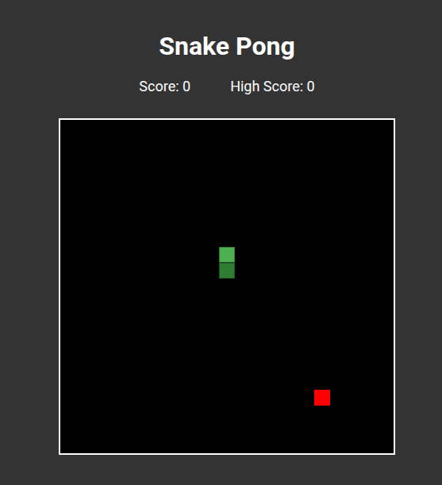

# 🐍 Snake Pong - React Edition

A modern reimplementation of the classic Snake game with a twist: the food moves dynamically like a Pong ball! Originally built with Vanilla JS, this project was refactored to **React** to leverage component-based architecture and Hooks.


## 🎮 How to Play

* **Arrow Keys:** Control the snake's direction.
* **Enter:** Restart the game after a Game Over.
* **Objective:** Eat the food (red square) to grow and earn points. Watch out! The food moves and bounces off the walls.

## 🚀 Features

* **Classic Snake Mechanics:** Movement, collision detection (walls and self), and tail growth.
* **"Pong" Food Logic:** The target isn't static; it moves and bounces, adding a layer of difficulty.
* **High Score System:** Persists your best score using the browser's `localStorage`.
* **React Hooks:** Built entirely using functional components with `useState`, `useEffect`, `useRef`, and `useCallback`.
* **Canvas API:** Smooth rendering using HTML5 Canvas within a React context.

## 🛠️ Technologies Used

* **React.js** (Hooks & State Management)
* **HTML5 Canvas** (Rendering)
* **CSS3** (Styling & Responsive Layout)
* **Vite** (Build Tool)

## 📦 How to Run Locally

1.  **Clone the repository:**
    ```bash
    git clone [https://github.com/ianprocopio/Jogo.git](https://github.com/ianprocopio/Jogo.git)
    ```

2.  **Navigate to the project directory:**
    ```bash
    cd Jogo
    ```

3.  **Install dependencies:**
    ```bash
    npm install
    ```

4.  **Run the development server:**
    ```bash
    npm run dev
    ```

5.  Open your browser at `http://localhost:5173` (or the port shown in your terminal).

## 👨‍💻 Author

Developed by **Ian Procopio**.
* [GitHub](https://github.com/ianprocopio)
* [LinkedIn](https://www.linkedin.com/in/ian-proc%C3%B3pio-0012b239b/) ---
